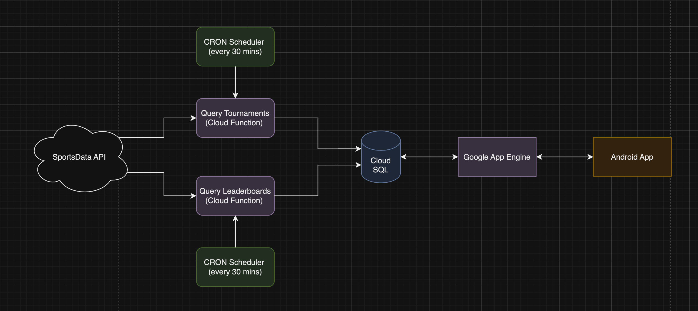

# golf-better
  

To build and run the Android app:
- Install Android Studio and load code
- Login to golf-better GCP account with gcloud
- Run the app in one of these ways:
  - Install an emulator and run from Android Studio
  - Connect a real device (either using USB or "adb tcpip") and run from Android Studio
  - Build an APK and push to a real device

See directories under /gcp for specific READMEs.

# Repo structure

- [/app](/app) - Android app
  - Also the parent directory [/](/) contains gradle build info
- [/gcp](/gcp) - Other infrastructure/applications to manage the backend database, app engine, etc.
  - [/gcp/app-engine](/gcp/app-engine) - App Engine code for serving data to the Android app
  - [/gcp/cloud-functions/refresh-pga-data](/gcp/cloud-functions/refresh-pga-data) - Cloud Function for periodically syncing PGA APIs into CloudSQL
  - [/gcp/cloud-functions/refresh-leaderboards](/gcp/cloud-functions/refresh-leaderboards) - Cloud Function for periodically syncing tournament leaderboard info from SportsData API into CloudSQL
  - [/gcp/cloud-functions/refresh-tournaments](/gcp/cloud-functions/refresh-tournaments) - Cloud Function for periodically syncing tournament info from SportsData API into CloudSQL
  - [/gcp/scripts](/gcp/scripts) - Ad hoc scripts for maintenance, monitoring, etc.
- [/.github/workflows](/.github/workflows) - CI scripts

# System diagram

